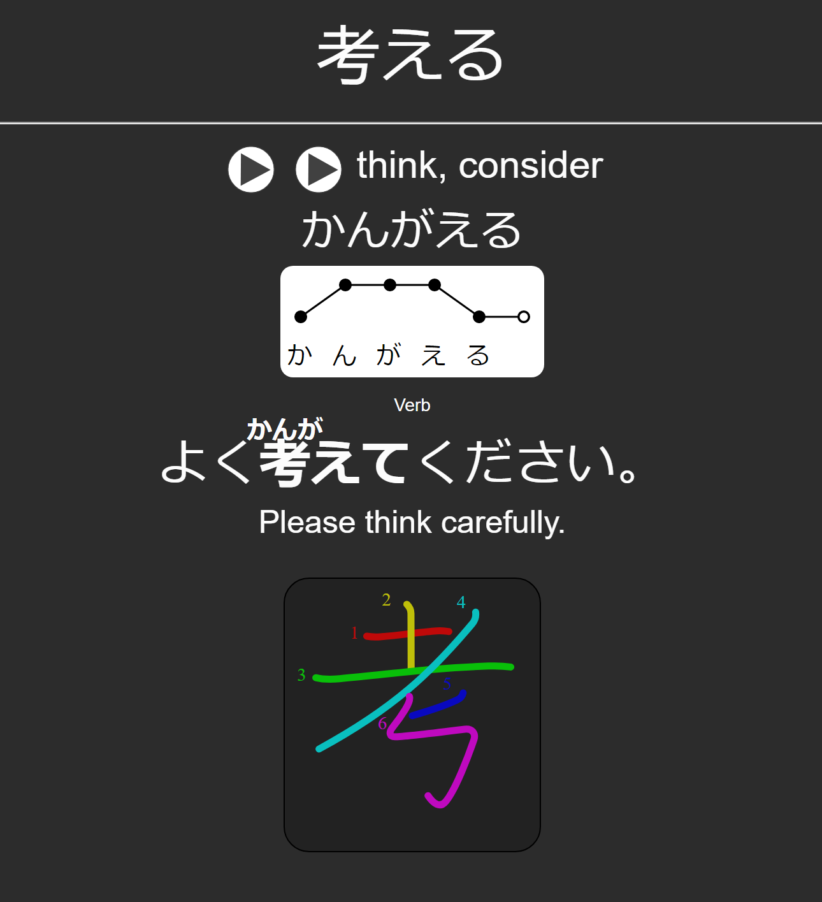
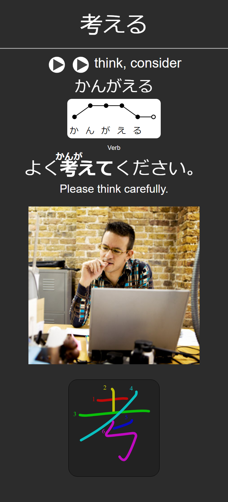

# Core2k6k_All_in_one
A Core2k6k deck variant with pitch accent, stroke order diagrams, optional sentence images, and a lots more!

DOWNLOAD LINK: [Latest Release](https://github.com/amaank404/Core2k6k_All_in_one/releases/latest)

## Variants

### No Images

### With Images

## Description

These are the latest Core2k6k Anki Decks that offer the following features:

* Kanji on the frontside
* Kanji audio
* Pitch Accent
* Word type (part of speech)
* Example Sentence (furigana included)
* Example Sentence English
* Image related to Kanji (optional, some believe it helps, some believe it doesn't)
* Kanji Stroke Order

It is suggested that you practice writing on a notebook while studying this deck. This will improve your writing skills tremendously. Also, try to pronounce the word with correct pitch accent to learn natural accent from ground up, this shall prove to be very useful when you continue to learn.

If you are a **new japanese learner** that wants a source to learn vocabulary, this is deffinately for you. Before you start studying, I suggest that you learn the following concepts:

* What is japanese pitch accent?
* How to read hiragana?
* Why is kanji stroke order so important?

After all that, go ahead and download anki and set it up. From there, all you need to do is download the files from [Releases Tab](https://github.com/amaank404/Core2k6k_All_in_one/releases/latest). Then import the deck from "File > Import".

